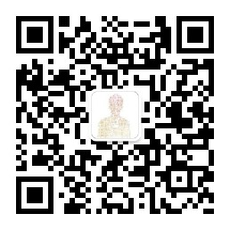

# GoAI的学习小屋

> 🌐**网站简介：本站主要分享大数据与人工智能方向开源知识，具体总结内容可通过目录访问，欢迎各位大佬交流指点。**

> 👨‍💻**作者简介：** 大数据专业硕士在读，CSDN人工智能领域博客专家、阿里云社区专家博主、百度飞桨PPDE、飞桨校领航团团长、飞桨开源特训营导师、CSDN新星计划计算机视觉方向导师、人工智能赛道Top5、内容合伙人，曾获科大讯飞top10及竞赛奖项若干。
 
>💚**公众号：** GoAI的学习小屋，免费分享总结、书籍、简历、导图、面经等，更有qq交流群免费分享宝藏资料，加群方式公众号回复“加群”或➡️[**点击链接**](https://qm.qq.com/cgi-bin/qm/qr?k=YksJ4zWlaOo_ya7Ey_cpjfbgGxJtQLIZ&jump_from=webapi&authKey=ub6O4L4nqKep8KVTv3pkx%20x18IeIgDuUgKvOL/Wwq2utRODmWnZcxoo8rGHcHnIB)。

> 🎉**专栏推荐：** ➡️ **[《计算机视觉》](https://blog.csdn.net/qq_36816848/category_11641419.html)** 总结目标检测、图像分类、分割OCR、等方向资料。 ➡️ **[《深入浅出OCR》](http://t.csdn.cn/vISpP):**  对标全网最全OCR教程，含理论与实战总结。以上价格便宜长期更新，感兴趣小伙伴可关注。

> ✨**学习者福利：** 强烈推荐优秀AI学习网站，包括机器学习、深度学习等理论与实战教程，非常适合AI学习者。➡️[**网站链接**](https://www.cbedai.net/goai)。

> 👏**技术控福利：** 程序员兼职社区招募！技术范围广，CV、NLP均可，要求有一定基础，最好是研究生及以上或有工作经验，也欢迎有能力本科大佬加入！群内Python、c++、Matlab等各类编程单应有尽有, 资源靠谱、费用自谈，有意向者直接访问➡️[**链接**](https://doc.weixin.qq.com/sheet/e3_AbEADgZXANESk3HUThAQ0u6WSAV04?scode=AMcAFgfjAAYS3RQ2CIAbEADgZXANE&tab=upwjhg)。

## 🆙作者主页

 > *📝注：最新学习博客 |笔记会更新在下方CSDN博客链接*：https://blog.csdn.net/qq_36816848
 <!--- 

-->

 

  &emsp; 
  &emsp;
  &emsp;
  &emsp; 
  &emsp;
  &emsp;
  &emsp;
 <!--- &emsp;  -->
<!-- 访客数统计徽标 -->
  

 

* 公众号 : GoAI的学习小屋 【学习交流或商业合作可扫码填加作者微信】

  

* QQ交流群 : GoAI的学习小屋  ➡️[点击链接加群](https://qm.qq.com/cgi-bin/qm/qr?k=YksJ4zWlaOo_ya7Ey_cpjfbgGxJtQLIZ&jump_from=webapi&authKey=ub6O4L4nqKep8KVTv3pkx%20x18IeIgDuUgKvOL/Wwq2utRODmWnZcxoo8rGHcHnIB)。

  

# 🎉学习资料目录

## 1.深度学习

* [机器学习资料](https://blog.csdn.net/qq_36816848/category_10846122.html)
* [深度学习笔记](https://blog.csdn.net/qq_36816848/category_11053032.html)
* [深度资料合集](https://blog.csdn.net/qq_36816848/article/details/125829496)
* [Pytorch系列](https://blog.csdn.net/qq_36816848/category_11477132.html)
* [计算机视觉模型](md/cv.md)
* [深度学习网络模型](md/model.md)

## 2.计算机视觉

* [Opencv系列](https://blog.csdn.net/qq_36816848/article/details/123805173)
* [计算机视觉模型](md/cv.md)

###   计算机视觉论文总结系列：

> 1️⃣[计算机视觉论文总结系列（一）：目标检测篇](http://t.csdn.cn/Im8zn)
> 
> 2️⃣[计算机视觉论文总结系列（二）：图像分割篇](http://t.csdn.cn/Wzx3L)
> 
> 3️⃣[计算机视觉论文总结系列（三）：OCR篇](https://blog.csdn.net/qq_36816848/article/details/130147440) 

###    计算机视觉竞赛总结系列：

> 1️⃣[计算机视觉竞赛总结系列（一）：目标检测篇](https://blog.csdn.net/qq_36816848/article/details/129407563)
> 
> 2️⃣[计算机视觉竞赛总结系列（二）：图像分割篇](https://blog.csdn.net/qq_36816848/article/details/129763001)
> 
> 3️⃣[计算机视觉竞赛总结系列（三）：OCR篇](https://blog.csdn.net/qq_36816848/article/details/130100877) 

### **注意力机制详解系列目录：**
>  1️⃣[注意力机制详解系列（一）：注意力机制概述](https://blog.csdn.net/qq_36816848/article/details/129206299)
> 
> 2️⃣[注意力机制详解系列（二）：通道注意力机制](https://blog.csdn.net/qq_36816848/article/details/129206184)
> 
> 3️⃣[注意力机制详解系列（三）：空间注意力机制](https://blog.csdn.net/qq_36816848/article/details/129207369)
> 
>  4️⃣[注意力机制详解系列（四）：混合注意力机制](https://blog.csdn.net/qq_36816848/article/details/129207419)
> 
> 5️⃣[注意力机制详解系列（五）：分支与时间注意力机制](https://blog.csdn.net/qq_36816848/article/details/129288326)

## 3.OCR

* [OCR文字识别技术系列第一章](https://blog.csdn.net/qq_36816848/article/details/12390856)
* [OCR文字识别技术系列第二章](https://blog.csdn.net/qq_36816848/article/details/12394341)
* [OCR文字识别技术系列第三章](https://blog.csdn.net/qq_36816848/article/details/12395907)
* [OCR文字识别技术系列第四章](https://blog.csdn.net/qq_36816848/article/details/12405580)
* [OCR文字识别技术系列第五章](https://blog.csdn.net/qq_36816848/article/details/12413149)
* [OCR方法综述合集](https://blog.csdn.net/qq_36816848/article/details/125615331)
* [OCR论文详解合集](https://blog.csdn.net/qq_36816848/article/details/125126563)
* [CRNN](https://blog.csdn.net/qq_36816848/article/details/121723891)
* [Attention](https://blog.csdn.net/qq_36816848/article/details/122743693)
* [Transformer](https://blog.csdn.net/qq_36816848/article/details/123177970)

## 4.大数据

* [大数据开发笔记](https://blog.csdn.net/qq_36816848/article/details/113767367)
* [Hadoop系列综合](https://blog.csdn.net/qq_36816848/category_10847000.html)

* [大数据项目实战](https://blog.csdn.net/qq_36816848/category_11274508.html)
* [数据分析与挖掘](https://blog.csdn.net/qq_36816848/category_10976756.html)

## 5.推荐系统

* [推荐算法理论](https://blog.csdn.net/qq_36816848/category_10770781.html)
* [深度学习推荐模型](https://blog.csdn.net/qq_36816848/category_10770781.html)
* [音乐推荐系统项目](https://blog.csdn.net/qq_36816848/article/details/108383078)
* [新闻推荐系统合集](https://blog.csdn.net/qq_36816848/article/details/121941803)

# 入门系列

* *零基础入门深度学习系列：*

> [>零基础入门深度学习(1) - 感知器](https://www.zybuluo.com/hanbingtao/note/433855)
>
> [零基础入门深度学习(2) - 线性单元和梯度下降](https://www.zybuluo.com/hanbingtao/note/448086)
>
> [零基础入门深度学习(3) - 神经网络和反向传播算法](https://www.zybuluo.com/hanbingtao/note/476663)
>
> [零基础入门深度学习(4) - 卷积神经网络](https://www.zybuluo.com/hanbingtao/note/485480)
>
> [零基础入门深度学习(5) - 循环神经网络](https://zybuluo.com/hanbingtao/note/541458)
>
> [零基础入门深度学习(6) - 长短时记忆网络(LSTM)](https://zybuluo.com/hanbingtao/note/581764)
>
> [零基础入门深度学习(7) - 递归神经网络](https://zybuluo.com/hanbingtao/note/626300)

* *大数据入门笔记系列：*

> [大数据开发面试知识点总结](https://blog.csdn.net/qq_36816848/article/details/113767367)
>
> [大数据开发笔记（一）：HDFS介绍](https://blog.csdn.net/qq_36816848/article/details/112862040)
>
> [大数据开发笔记（二）：Yarn分布式集群操作系统](https://blog.csdn.net/qq_36816848/article/details/112862067)
>
> [大数据开发笔记（三）：Mapreduce](https://blog.csdn.net/qq_36816848/article/details/112862086)
>
> [大数据开发笔记（四）：Hive分区详解](https://blog.csdn.net/qq_36816848/article/details/113782028)
>
> [大数据开发笔记（四）：Hive数据仓库](https://blog.csdn.net/qq_36816848/article/details/112862113)
>
> [大数据开发笔记（五）：Zookeeper](https://blog.csdn.net/qq_36816848/article/details/113106315)
>
> [大数据开发笔记（六）：Flume基础学习](https://blog.csdn.net/qq_36816848/article/details/113633737)
>
> [大数据开发笔记（七）：Kafka分布式流式处理](https://blog.csdn.net/qq_36816848/article/details/113637300)
>
> [大数据开发笔记（八）：Spark综合总结及Sparksql](https://blog.csdn.net/qq_36816848/article/details/113359463)
>
> [大数据开发笔记（八）：Sparkstreaming](https://blog.csdn.net/qq_36816848/article/details/113638125)
>
> [大数据开发笔记（九）：Flink基础](https://blog.csdn.net/qq_36816848/article/details/114260688)
>
> [大数据开发笔记（九）：Flink综合学习](https://blog.csdn.net/qq_36816848/article/details/114260722)
>
> [大数据开发笔记（十）：Hbase实践](https://blog.csdn.net/qq_36816848/article/details/112862238)

* *大数据其他笔记：*

> [Hadoop常见端口总结](https://blog.csdn.net/qq_36816848/article/details/113106441)
>
> [大数据常见运维问题汇总](https://blog.csdn.net/qq_36816848/article/details/114897825)

